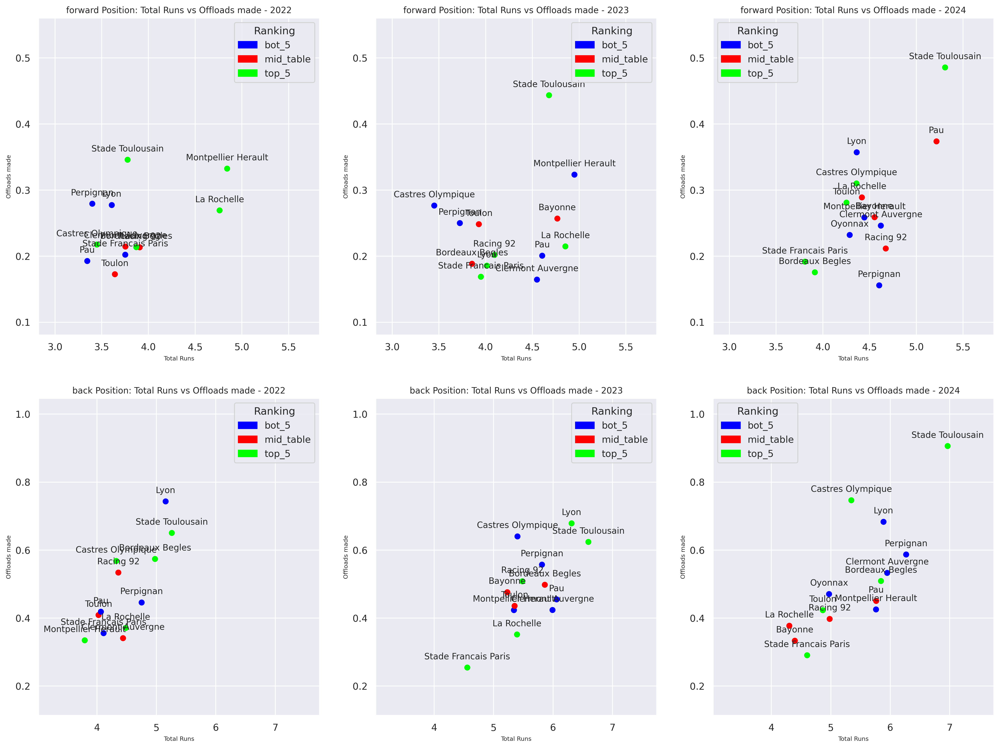

# Test Blog Post for Template Reference 

----


Disclaimer: This is a test blog post to be used eventually as a template for other blogs in the future 

----

Using this file to test different markdown executions, and view the outputs of the test code and syntax 

- View python code in the markdown executable 
- View only the executed code 
- View graphs 
- View pictures 
- Logo and coloring 

----

## View python code in the markdown executable 

```python
def return_passed_val(string):
    if type(string) == type(1):
        return string + 1 
    else:
        return string
```

----

## View only the executed code 

### At this time unable to do without installing other python package dependecies with im trying to avoid 

```python-exec

def return_passed_val(string):
    if type(string) == type(1):
        return string + 1 
    else:
        return string

return_pass_val('tester')
return_pass_val(1)

```

----

## View graphs and pictures 

<!--  -->

<!--  -->


----


