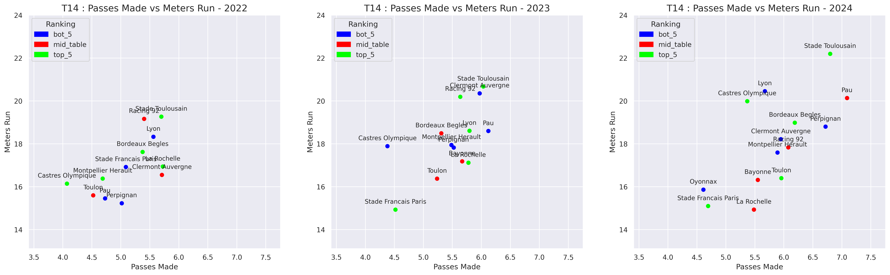
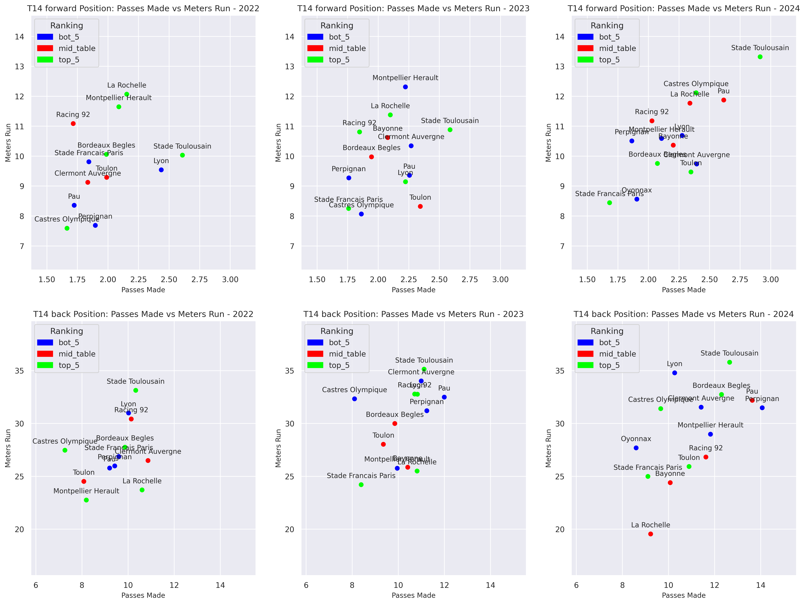
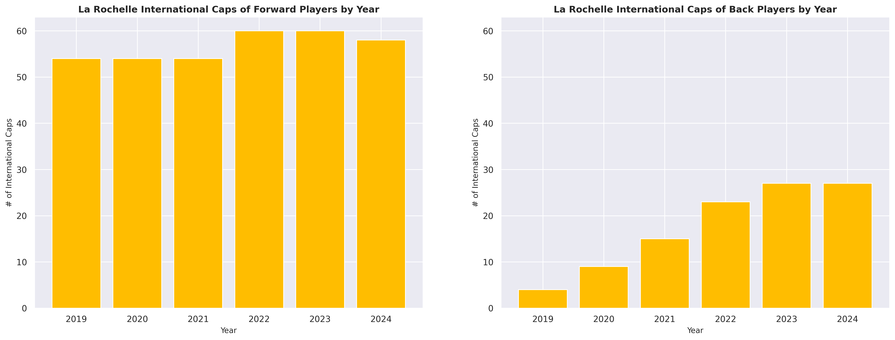

# "Who's running your team?: A collection of new stats I'm trying out and seeing how that stack up"

----

Disclaimer: This is a test blog post to be used eventually as a template for other blogs in the future 

----

To start out I'll say this, Rugby is not baseball. It hurts a lot more, and it's not inherently applicable to next-gen statistics and analytics. But it won't stop people from trying, including me. 

Analytics alone in any sport is rarely going to win you a championship. A good analyst should approach sports analytics with a knowledge of the data, and a knowledge of the game. Understanding how the data fits into the the sport and whats actually happening on the spreadsheet. 

I have a genuine interest and knowledge of rugby (what I would call the greatest sport), and aim to use the data to tell an interesting story about winning and losing teams/players. 

Guess what? Antoine Dupont is really good, in every stat category. His club team, Stade Toulousain, and international team, France, are both really good too. But where is it less obvious? What teams do they succeed and struggle against the most? What teams in other leagues match up the most? These are the kind of less obvious questions that hope to be anwsered. 

These questions that are hidden in the dimensions and interactions of the data (hidden or lightly covered). So here are a few interesting findings that I want to talk about from digging through the rugby data. 

FIX THIS INTO INTO THE DATA PORTION JUST A HOLDER 

----

## Meters Run by Passes Made 

----

The basis behind this statistic is trying to narrow down how teams are gaining their ground. There are many assumptions being made here, but the logic is that a team that averages a large amount of meters while averaging a large amount of passes is gaining their meters more often through set plays and multiple runners that efficient ball movement. A team that averages a large amount of meters and a relativly smaller amount of passes per game are gaining their meters through either crash ball plays or through big individual clean breaks. 

If we just want to consider this as it sounds, our statisic would just be the Average Meters Gained / Average Passes Completed.

So on the topic of Antoine Dupont lets take a look at his club league, the Top 14, arguably the best Rugby Union league in Europe. 

No surprise here, Toulouse leads the way in both categories. And exciting, they're only getting better. 

There does not appear to be a correlation between league standing and high meters run and passes made relative to other teams. There are teams from the top and bottom at both extremes each year. However, different positions run the ball in different ways, so below we split out the same graphs by backs and forwards to see the changes. 

Stade Toulousain has dominated in the back line for years, the forward pack appears to be where they don't always lead the league. La Rochelle is an interesting example to look at. With a head coach that is experienced in the backline, Ronan O'Gara, they consistenting top the league for forward meters and passes per game, and fall near the bottom for the backline. 

However, in order to account for the number of runs that are taken during the game, which we should do to ensure that teams that are just always on offense aren't swaying the statistic, we compute what I'm calling "Adjusted Meters per Passes":

$$\text{Adjusted Meters per Pass} =\frac{\text{Total Meters Gained}}{\text{Total Passes x Total Runs}}$$

# La Rochelle Deep Dive 

La Rochelle has dominated in recent years in European Rugby Competitions. Winning the Champions Cup in 2022 and 2023. La Rochelle has never won the T14 League Championship, with Toulouse dominating there for the most part in the past 5 years. 

La Rochelle's inequality between their forwards and backs is clear when we look at where the most internationally recognized players are lining up. 

The La Rochelle backline averages about half the amount of total international caps compared to the forward pack. The increase over the 6 year time period for backline caps could be attributed to draw and innovation from Head Coach Ronan O'Gara, focusing his efforts where he specialized compared to forward caps largly staying constant over the same time. 

## Top Performing Forwards at La Rochelle 

Not too surprising when ranking the La Rochelle forwards by Meters per Passes (adjusted and regular) are loose forward players. 

Gregory Alldritt and Will Skelton will always be near the top, no news there. The guys that are interesting to see are ones like Pierre Bourgarit and Paul Boudehent. 

